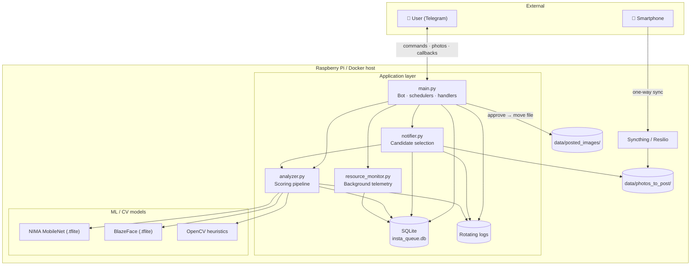
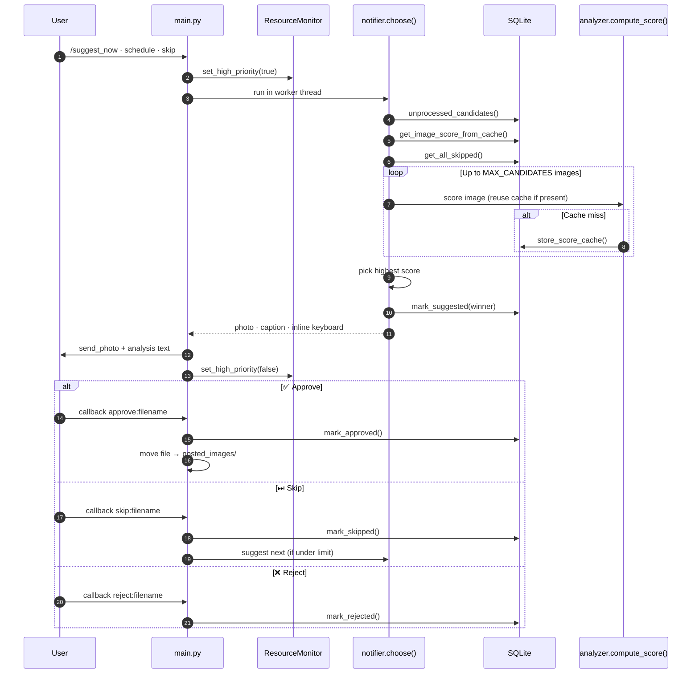
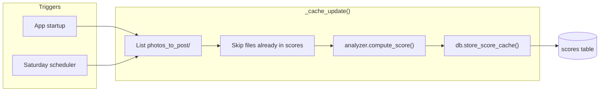
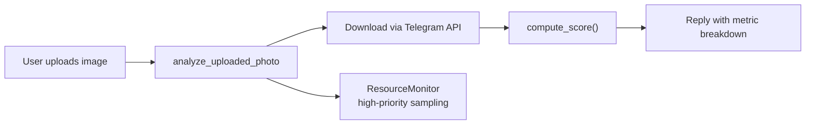

# 📸 InstaPhotoPostSuggestion

**Automated Photo Curation & Suggestion Engine for Raspberry Pi**

> **TL;DR:** A Python-based automation tool that syncs photos from your phone to a Raspberry Pi, scores them based on quality and context (weather, time, composition, image quality, aesthetics), and sends the best "Instagram-ready" suggestions to you via a Telegram Bot.

---

## 🏗 Architecture

The system operates as a localized automation pipeline on a Raspberry Pi (or Docker container). Photos sync from your phone into a watch folder; a long-running Telegram bot scores candidates, caches results, and pushes the best pick back to you.

### System architecture



### End-to-end suggestion flow

Triggered by **`/suggest_now`**, the **weekly scheduler** (Sunday), or **Skip** (up to `SKIP_RETRY` times).



### Cache pre-warm flow

Scores are cached in the **`scores`** table so repeat runs stay fast (~15–20 s for 50 images when warm).



### On-demand upload analysis

Send a photo directly in chat (gallery **Photo** or **image document**) for instant scoring without adding it to the sync folder.



### Pipeline summary

1. **Sync:** Photos are mirrored from your smartphone to a specific folder on the Raspberry Pi (via Syncthing/Resilio).
2. **Ingest:** The system scans for images available for posting, scores them, and stores metadata in SQLite DB.
3. **Score:** A logic engine analyzes images for:
   * **Aesthetic:** NIMA MobileNet DL model
   * **Quality:** Sharpness, Exposure, Color harmony.
   * **Content:** Face Detection (Mediapipe, Blaze Face Short range model).
   * **Context:** Matches image mood to current month and season for color and hue alignment.
4. **Notify:** The Telegram Bot pushes the highest-scoring image to the user.
5. **Interact:** User accepts (posts), skips (ignores and suggests a new one) or rejects (discard the image) the suggestion directly from the chat.

---

## ✨ Key Features

* **📱 Auto-Sync:** Seamless one-way sync from mobile to Pi.
* **🧠 Smart Scoring:** Algorithms that prioritize photos based on lighting and "human interest" (face count).
* **🤖 Telegram Bot:** Get your photo suggestions where you spend your time.
* **☁️ Context Awareness:** Suggest "sunny" photos on sunny days.
* **📊 On-demand Image Analysis:** Analyzes the uploaded image and provides image scores.
* **⚡ Caching & fast analysis:** Per-image scores are stored in SQLite so repeat runs skip heavy work; see **Performance & observability** below.
* **📈 Resource monitor:** Background sampling of CPU, memory, and (on Pi) temperature, persisted for `/status` and `/last_run` commands.

---

## ⚡ Performance & observability

* **Caching:** Image analysis results are **cached in the database** (`scores` table). The first pass computes full metrics; later suggestion runs reuse cached features so analysis and picking a winner stay fast.
* **Analysis speed:** The scoring pipeline is tuned for edge devices—expect on the order of **~3 seconds per image** end-to-end when analyzing from scratch (model + CV features; actual time varies with Pi load and image size).
* **Suggestions at scale:** With caching populated, processing up to **50 candidate images** and sending a suggestion typically finishes in about **15–20 seconds** instead of re-running the full stack on every file each time.
* **Resource monitor:** A **background resource monitor** thread records system utilization (CPU, app RSS memory, temperature on Raspberry Pi) into SQLite telemetry. Use the bot’s health commands to inspect recent snapshots and utilization during the last heavy analysis window.

---

## 🛠 Tech Stack

* **Hardware:** Raspberry Pi 4 (Recommended)
* **Language:** Python 3.10+
* **Computer Vision:** OpenCV (`cv2`), Pillow (`PIL`), Mediapipe
* **Database:** SQLite
* **APIs:**
  * [python-telegram-bot](https://python-telegram-bot.org/)
* **DevOps:** Docker

---

## 🚀 Getting Started

### Prerequisites
* Raspberry Pi with Python 3 installed.
* A Telegram Bot Token (from @BotFather).

### Installation

1. **Clone the Repository**
   ```bash
   git clone [https://github.com/yourusername/InstaPhotoPostSuggestion.git](https://github.com/yourusername/InstaPhotoPostSuggestion.git)
   cd InstaPhotoPostSuggestion
   ```

2. **Install Dependencies**
   ```bash
   pip install -r requirements.txt
   ```
   
3. **Configuration**<br>
   Rename .env.example to .env / .env.docker (if using docker compose for deployment) and populate your keys<br>

### 🚀 Deployment & Execution

#### 1. Manual Run (Testing)
```bash
python main.py
```

#### 2. Running as a Background Service (Recommended)
To ensure the bot runs 24/7 and restarts on boot, use systemd.
1. Create a bash file start_insta_project.sh:
```bash
#!/bin/bash
# Path to your project folder
PROJECT_DIR=/home/pi/InstaPhotoPostSuggestion
# Path to your virtual environment activation script
VENV_ACTIVATE=$PROJECT_DIR/env/bin/activate
# Path to your main Python program
PYTHON_PROGRAM=$PROJECT_DIR/src/main.py

# Change directory to the project folder
cd $PROJECT_DIR

# Activate the virtual environment
source $VENV_ACTIVATE

# Execute the Python program
exec python3 $PYTHON_PROGRAM
```

2. Create the service file:
```bash
sudo nano /etc/systemd/system/instabot.service
```

3. Paste the following configuration (adjust paths to match your setup):
```toml
[Unit]
Description=My Headless Python Project for Insta Posts
After=network.target

[Service]
User=username
WorkingDirectory=/home/username/InstaPhotoPostSuggestion
# Use the shell script from Step 1
ExecStart=/home/username/start_insta_project.sh
Restart=always
StandardOutput=journal
StandardError=journal

[Install]
WantedBy=multi-user.target
```

4. Enable and Start the service:
```bash
sudo systemctl daemon-reload
sudo systemctl enable instabot.service
sudo systemctl start instabot.service
```

5. Check status or logs:
```bash
sudo systemctl status instabot.service
# To view live logs:
journalctl -u instabot.service -f
```

#### 3. Containerized Execution
For easier deployment across platforms
1. Install docker (In case of running on Raspberry Pi):
```bash
sudo apt update
sudo apt upgrade -y

# install docker
curl -sSL https://get.docker.com | sh

# for running docker commands without root privileges
sudo usermod -aG docker $USER

# install docker-compose
sudo apt install -y docker-compose
```

2. Env keys configuration
- Rename .env.example to .env.docker
- Populate your keys
- Add ```RUNNING_IN_DOCKER=true``` to end of .env.docker

3. Build and spin container
```bash
# build and spin container using docker-compose
docker-compose up --build -d

# verify built image and container creation
docker images
docker ps
```
   
---

## 🔮 Roadmap & Backlog

We are actively working on moving from MVP to V2.0. Here is the current development plan:

### 🚧 In Progress
* **[AI] Smart Captions:** Integration with local or cloud LLMs to generate Instagram captions for approved photos.

### 📋 Planned Features
* **[Post-Pro] Template Engine:** Auto-format approved images into 4:5 or 1:1 aspect ratios with borders.

---

## 🤝 Contributing

Pull requests are welcome! For major changes, please open an issue first to discuss what you would like to change.

---